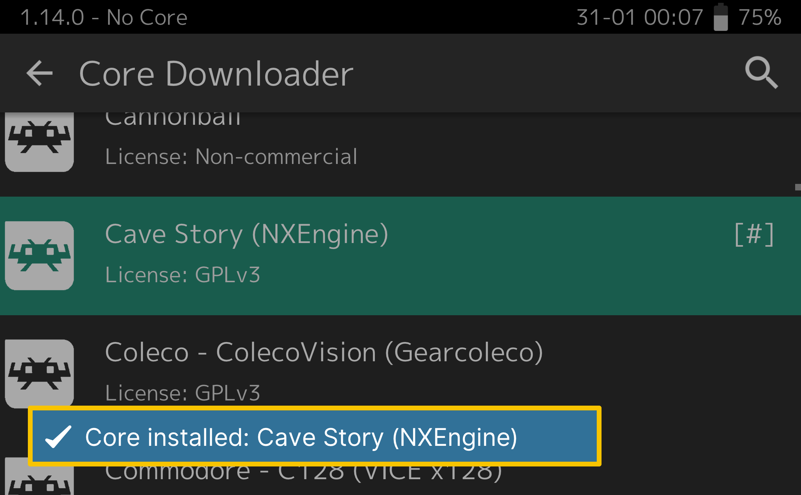

   
  <b>RetroArch UWP ARM32 only</b> 
  <a href="./cores">Cores</a> |
  <a href="https://github.com/libretro/RetroArch">Original Project</a> 
    
    

# About

After long time of work I present to you this UWP release of RetroArch for Windows (ARM32) devices

With more than 70+ core

# Target (ARM32)

- Windows 15035+ Full cores
- Windows 14393 with few cores
- Windows 10586 with few cores
- DirectX Feature level 11, 9.3 & 9.1

## ARM64 or Latest

- This repo for ARM32, legacy support only
- Refer to the official repo for any updates [Click here](https://retroarch.com/?page=platforms)
- Please don't ask or contact me for other than ARM32
- This repo is not meant to be up-to date fork (nor redistribution)

# UWP improvements

This app supported by [UWP2Win32](https://github.com/basharast/UWP2Win32)

# Cores updater

The current cores downloader/updater linked with my repo at `docs/cores`

if you want to help to get/fix more cores for ARM please submit pull request with the target core or contact me

# Credits

- <a href="https://www.retroarch.com/">RetroArch</a> Developed by RetroArch Team 

- Bashar Astifan (UWP Improvements and ARM support)

- [Gustave Monce](https://github.com/gus33000) (DLL dynamic loading solution)

# Support

RetroArch Team done great job to make this project if you would like to support them <a href="https://www.retroarch.com/index.php?page=donate">Click Here</a>

# Building

- You need SDKs: 19041 and 14393
- Use Visual Studio 2022
- Goto pkg\msvc-uwp
- Use only `RetroArch-msvc2019-UWP.sln` 
- You can build it as `ReleaseANGLE`
- There is also Release 14393 (no much cores)
- To ensure cores loaded correctly, you can make them built-in
- Built-in cores must be at `pkg\msvc-uwp\RetroArch-msvc2019-UWP\cores`

## D3D 9.3 & 9.1

- Use `ReleaseANGLE Legacy`
- Or create new config from `ReleaseANGLE 14393 D3D` 
- Define `IS_LEVEL_93` in project Preprocessors
- Remove the following from project Preprocessors
- - `HAVE_OZONE`
- - `HAVE_XMB`

## Important

This project maintained for legacy hardware, when something don't work well on modern hardware

please don't open issue for it, I have no interests to support other than ARM32

## WinRT Surface

I'm refering to the ARM32 old one, it was before super slow and the reason was:

- Only ANGLE was used to support older devices
- ANGLE don't have support for feature level 9.1
- It will fallback to WARP device (more like software render)
- 5~ frames per seconds was expected (WARP is super slow)
- With the latest update in theory it's expected to work under DirectX and should be fast.

# Note

I'm not affiliate with RetroArch or Libretro
